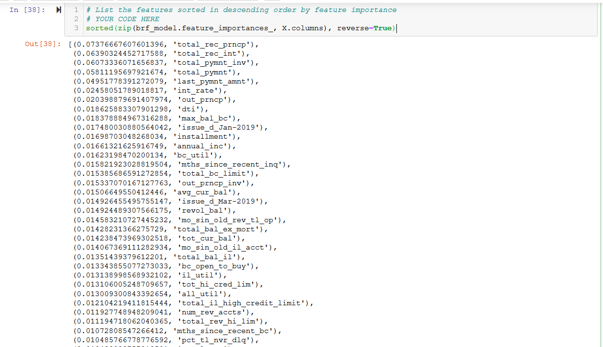

# Credit_Risk_Analysis

## I.	Overview

Fast Lending LLC, a peer-to-peer lending company, has hired SATC Consulting to help improve its credit risk assessment operations. Credit risk is an inherently difficult classification problem. We propose employing several supervised machine learning methods in order to find which model will improve a lender’s ability to identify potentially bad borrowers. The data we used was from Fast Lending’s loans data set for the first quarter of 2019. In the set, there were over 115,000 loan applications with 86 features, making the modeling and analysis robust enough for us to draw reasonable and reliable conclusions. The target feature we were interested in investigating was “loan_status” and we compared against the other 85 features within the data set. There were six supervised machine learning models that we employed:

1.)	Naïve Random Oversampling

2.)	SMOTE Oversampling

3.)	Undersampling

4.)	Combination (Over- and Under-) Sampling

5.)	Balanced Random Forest Classifier

6.)	Easy Ensemble AdaBoost Classifier

We evaluated the efficacy of the models based on their individual accuracy scores and confusion matrices. Our results are presented in the “Results” section of this report.

## II.	Results
•	Naïve Random Oversampling Results: 

Analysis: Naïve random sampling involves the process of including instances of the minority class until the majority and minority classes are balanced. The prerequisite of employing this model is that there is an inherently lopsided class imbalance between the majority and minority classes that makes it very difficult to accurately predict the minority class using regular supervised models. 

As you can see in the previous image, the accuracy of the model was 62%. While this is better than a coin flip, it is not significantly greater than 50% meaning that we would have trouble relying on this model alone to make bad loan predictions. Looking upon the precision (“pre” column) and recall (“rec” column) numbers, we can shed more light into the efficacy of the model. Though the precision numbers are great for predicting low risk applicants, it is not so effective in doing the same for low risk, which in the context of this project, is more important to identify even though historically, they have been small in their numbers. The recall numbers for both the majority and minority classes, as with the accuracy number, are not very impressive. As a result, we need to look at other models and methods that can improve these outcomes.

•	SMOTE Oversampling Results:

Analysis: The synthetic minority oversampling technique (SMOTE) is another oversampling approach to deal with lopsided imbalances between the majority and minority binary classes within a dataset. As with random oversampling, SMOTE increases the size of the minority class. The difference however, is that SMOTE creates new instances of the minority class through interpolation rather than random selection and replacement. 

The results of our SMOTE model are shown in the previous image. The numbers for accuracy (65%), precision (1% for high risk and 100% for low risk), and recall (64% for high risk and 66% for low risk) were very similar to the random oversampling model. In others, model performance barely improved from the previous method. Even though SMOTE reduces the risk of oversampling, it does not always out perform oversampling. Due to the mediocre performances of both oversampling models, we need to employ other supervised methods to come up with better predictive models. Please keep in mind that sampling techniques cannot overcome deficiencies in the data set that is being used.

•	Undersampling Results:

 
Analysis: In cluster cenroid undersampling The algorithm identifies clusters of the majority class, then generates synthetic data points, called centroids, that are representative of the clusters. The majority class is then reduced to the size of the minority class. As you can see from the results, the random undersampling model performed worse than BOTH of the oversampling models with an accuracy of 52%, which is equivalent to guessing which loans may default. However, in continuing to compare both oversampling models with this undersampling method, the precision rates were the same (1% for high risk and 100% for low risk) while the recall rate for high risk was almost the same at 61% but worsened to 45% for low risk. Overall, we do not recommend utilizing the undersampling model since its accuracy is barely above 50% and it perfroms worse than the other two models. 

•	Combination (Over- and Under-) Sampling Method Results: 

Analysis: Combination sampling combines both over- and undersampling techniques from supervised learning models. Specifically, we used the SMOTEENN technique which combines SMOTE and Edited Nearest Neighbors (ENN) algorithms. SMOTTEEN is a two-step technique: 1.) oversample he minority class with SMOTE and 2.) clean the resulting data with an undersampling strategy (in this case, ENN). 

The results of our SMOTEENN method are shown in the image above. Accuracy remained right around the level of the two previous oversampling techniques that we performed at 64%. Again, better than 50% but not to the degree we would like (75% or better) in terms of being able to rely on this model to make credible predictions with different data sets. More importantly, the precision numbers are the same as ALL PREVIOUS THREE MODELS: 1% for high risk, which is bad, and 100% for low risk, which is good but expected given that low risk significantly outweighs in data representation than high risk. Finally, the recall number for high risk is improved in comparison to the previous three models but is worse for low risk loans. 

•	Balanced Random Forest Classifier Results:

		
Analysis: The Balanced Random Forest Classifier is another ensemble method in which each tree of the forest is provided a balanced bootstrap sample. The accuracy of this method was around 91%, which is very impressive. However, we need to look at this number in the context of the precision and recall metrics. The precision for high risk loans improved from 1% for the other four models to 4% for this one (still pretty low though) while those for low risk loans remained around 100%. Recall was 67% for high risk loans, slightly better than the other four model, and 91% for low risk models, signficantly better than the other four models. As a result, we can reasonably rely on this model to make credible predictions of bad loans. 

•	Easy Ensemble AdaBoost Classifier Results:

Analysis: EasyEnsemble is an ensemble of AdaBoost learners trained on different balanced boostrap samples. The balancing is achieved by random under-sampling (reference: Python Pandas Documentation). The image shows that of the six models employed, the EasyEnsemble model performs the best. Accuracy is around 93% which is more than optimal for most model and precision for high risk data sets is improved to 7% (the highest of all six models) and recall is above 90% for both high risk and low risk loans (again, the highest of all six models). 

## III.	Summary

•	We recommend that Fast Lending employ the EasyEnsemble method for its Credit Risk assessments. While we certainly wish the models precision for high risk loans was singicinantly improved from the other models, it is still the highest for all six methods. 

•	Even though precision is low, recall is very high. Given the context of the business problem at hand, which is predicting bad loans, we would say that this metric is more important than the latter given that we would want the bad loans that are out there to be correctly categorized. 

•	It is important to remind the reader that there is a trade off between precision and recall and that it is up to the modelers and other decision makers to weigh which one is more important.

•	Accuracy of the model, especially given within the context of the high recall numbers, is very high at around 93%. This is the highest of all six models, but again we must be careful with this number given that the majority class (i.e., the number of good loans) significantly outweighs the minority class (i.e., the number of bad loans). 

•	For further research and modeling, we recommend that future analysts and decision makers engage in a serious process of feature reduction. Eighty-five categories is a large set of independent variables, many of which might create noise and add no information gain to understanding the target variable. Below is an image of the topped ranked independent variables in this data set (from the Balanced Random Forest Classifier):
 

The top six features explain about 33% of the data. We highly recommend that Fast Lending start their feature reduction methods by focusing on these six features first and then gradually increasing the number of features each time (if they need to) in order to improve model performance. 
